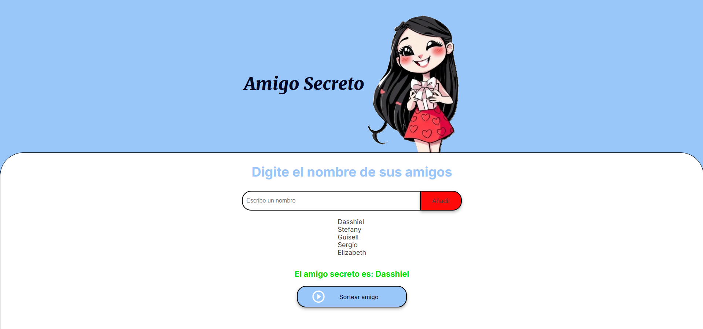

<h1> Proyecto Amigo Secreto</h1>

## Contexto
Esta es una aplicación web simple que permite a los usuarios ingresar nombres de amigos en una lista para luego realizar un sorteo aleatorio y determinar quién es el "amigo secreto".

## Funcionalidades

- **Agregar nombres**: Los usuarios pueden escribir el nombre de un amigo en un campo de texto y agregarlo a una lista visible al hacer clic en "Añadir".
- **Validar entrada**: Si el campo de texto está vacío o el nombre ya está en la lista, el programa mostrará una alerta pidiendo un nombre válido.
- **Visualizar la lista**: Los nombres ingresados aparecerán en una lista debajo del campo de entrada.
- **Sorteo aleatorio**: Al hacer clic en el botón "Sortear Amigo", se seleccionará aleatoriamente un nombre de la lista y se mostrará en la página.

## Instrucciones de Uso

1. Clona el repositorio en tu máquina local.
2. Abre el archivo `index.html` en tu navegador web.
3. Ingresa los nombres de tus amigos en el campo de texto y haz clic en "Añadir".
4. Una vez que hayas agregado todos los nombres, haz clic en "Sortear Amigo" para seleccionar un amigo secreto al azar.

## Apariencia

🌐 Deploy:

http://127.0.0.1:5500/index.html
